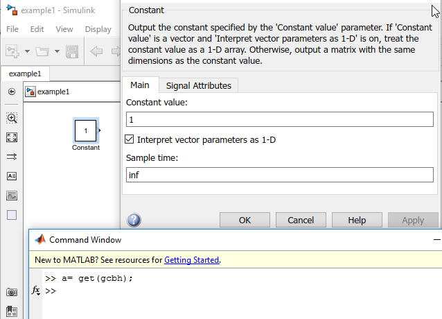
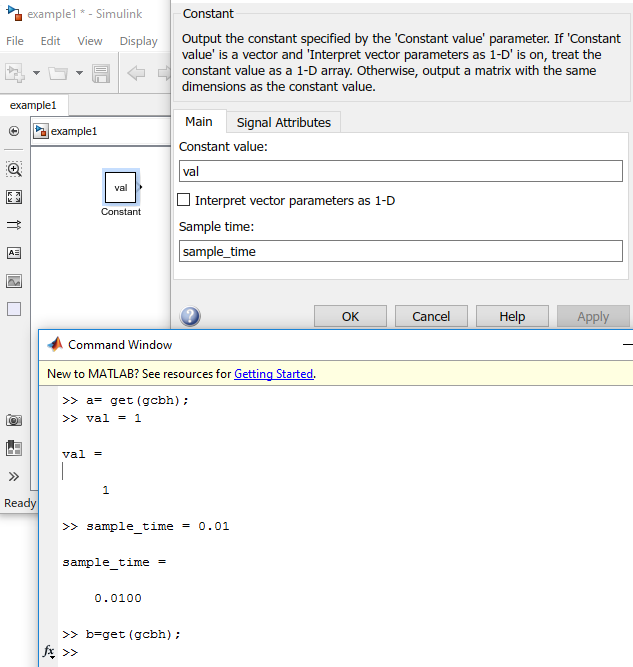
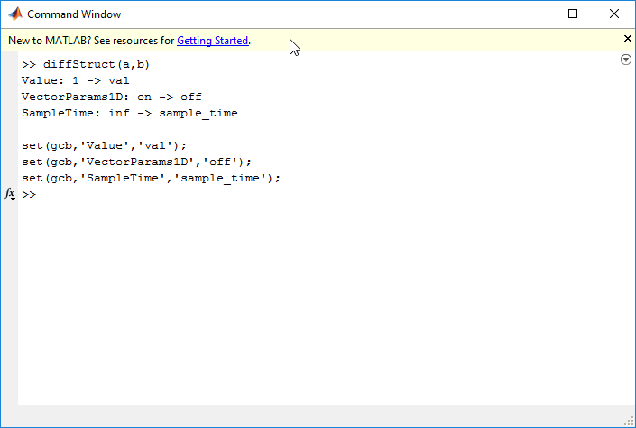

# matlab diffStruct

This tool was created and to highlight differences between Matlab structures.

Its primary use case is for programatically making changes to Simulink blocks.

## Useage by Example

### Constant Block

A simple default constant block. The Constant value and Sample time are defined in the block parameters dialog. ```get(gcbh)``` will get all parameters from **g**et **c**urrent **b**lock **h**andle. (See Verbose output below).

More complex examples will be left as an exercise to the reader.



Make some changes by hand through the GUI. 
- Value is now defined by variable ```val```
- Sample time is defined by variable ```sample_time```. 
- Interpret vector parameters as 1-D is **unchecked**.

Press Apply and run ```get(gcbh)``` again, storing the output into variable ```b```.



Running ```diffStruct``` on ```a``` and ```b``` will:

- Show the differences between the before and after in the format
  ```[Parameter]: [before] -> [after]```

For this example, this is the output:

```
Value: 1 -> val
VectorParams1D: on -> off
SampleTime: inf -> sample_time
```

- Print example code to programatically make the changes. The output uses ```gcb```, however this can be changed to a variable.

For this example, this is the output:

```
set(gcb,'Value','val');
set(gcb,'VectorParams1D','off');
set(gcb,'SampleTime','sample_time');
```



Verbose ```get(gcbh)``` output:

```
>> a = get(gcbh)

a = 

  struct with fields:
```

                                        Path: 'example1'
                                        Name: 'Constant'
                                         Tag: ''
                                 Description: ''
                                        Type: 'block'
                                      Parent: 'example1'
                                      Handle: 1.6200e+03
                             HiliteAncestors: 'none'
                             RequirementInfo: ''
                                    FontName: 'auto'
                                    FontSize: -1
                                  FontWeight: 'auto'
                                   FontAngle: 'auto'
                                    Selected: 'on'
                                    MaskType: ''
                             MaskDescription: ''
                                    MaskHelp: ''
                            MaskPromptString: ''
                             MaskStyleString: ''
                               MaskVariables: ''
                      MaskTunableValueString: ''
                          MaskCallbackString: ''
                            MaskEnableString: ''
                        MaskVisibilityString: ''
                           MaskToolTipString: ''
                          MaskVarAliasString: ''
                          MaskInitialization: ''
                          MaskSelfModifiable: 'off'
                                 MaskDisplay: ''
                               MaskIconFrame: 'on'
                              MaskIconOpaque: 'opaque'
                              MaskIconRotate: 'none'
                              MaskPortRotate: 'default'
                               MaskIconUnits: 'autoscale'
                             MaskValueString: ''
                    MaskRunInitForIconRedraw: 'off'
                           MaskTabNameString: ''
                                        Mask: 'off'
                               MaskCallbacks: {0×1 cell}
                                 MaskEnables: {0×1 cell}
                                   MaskNames: {0×1 cell}
                      MaskPropertyNameString: ''
                                 MaskPrompts: {0×1 cell}
                                  MaskStyles: {0×1 cell}
                           MaskTunableValues: {0×1 cell}
                                  MaskValues: {0×1 cell}
                         MaskToolTipsDisplay: {0×1 cell}
                            MaskVisibilities: {0×1 cell}
                              MaskVarAliases: {0×1 cell}
                             MaskWSVariables: []
                                MaskTabNames: {0×1 cell}
                                  MaskObject: []
                                       Ports: [0 1 0 0 0 0 0 0 0]
                                    Position: [65 25 95 55]
                                 Orientation: 'right'
                            PortRotationType: 'default'
                             ForegroundColor: 'black'
                             BackgroundColor: 'white'
                                  DropShadow: 'off'
                                      IOType: 'none'
                               NamePlacement: 'normal'
                                    ShowName: 'on'
                                    Priority: ''
                                   Commented: 'off'
                      AttributesFormatString: ''
                   TargetArchitectureMapping: {}
                           InstantiateOnLoad: 'off'
                         PolySpaceEndComment: ''
                       PolySpaceStartComment: ''
                               AncestorBlock: ''
                              ReferenceBlock: ''
                           SourceLibraryInfo: ''
                              LibraryVersion: ''
                          UserDataPersistent: 'off'
                                    UserData: []
                            CompiledIsActive: 'on'
                                     RTWdata: []
                                     HDLData: []
                                 Diagnostics: ''
                            DialogParameters: [1×1 struct]
                   IntrinsicDialogParameters: [1×1 struct]
                         AlgorithmParameters: [1×1 struct]
                SecondaryAlgorithmParameters: [1×1 struct]
                          CompiledSampleTime: [-1 0]
                            InputSignalNames: {1×0 cell}
                           OutputSignalNames: {''}
                         ModelParamTableInfo: []
                StatePerturbationForJacobian: '1.0e-05'
    SCDEnableBlockLinearizationSpecification: 'off'
          SCDBlockLinearizationSpecification: []
                                     CopyFcn: ''
                                   DeleteFcn: ''
                               UndoDeleteFcn: ''
                                     LoadFcn: ''
                               ModelCloseFcn: ''
                                  PreSaveFcn: ''
                                 PostSaveFcn: ''
                                     InitFcn: ''
                                    StartFcn: ''
                                    PauseFcn: ''
                                 ContinueFcn: ''
                                     StopFcn: ''
                               NameChangeFcn: ''
                                ClipboardFcn: ''
                                  DestroyFcn: ''
                                  PreCopyFcn: ''
                                     OpenFcn: ''
                                    CloseFcn: ''
                                PreDeleteFcn: ''
                              ParentCloseFcn: ''
                                     MoveFcn: ''
                                   BlockType: 'Constant'
                            BlockDescription: 'Output the constant specified b…'
                                  LinkStatus: 'none'
                            StaticLinkStatus: 'none'
                            PortConnectivity: [1×1 struct]
                                 PortHandles: [1×1 struct]
                                 LineHandles: [1×1 struct]
                          CompiledPortWidths: [0×0 struct]
                      CompiledPortDimensions: [0×0 struct]
                       CompiledPortDataTypes: [0×0 struct]
                           CompiledPortUnits: [0×0 struct]
                  CompiledPortComplexSignals: [0×0 struct]
                       CompiledPortFrameData: [0×0 struct]
                   DataTypeOverride_Compiled: 'UseLocalSettings'
              MinMaxOverflowLogging_Compiled: 'UseLocalSettings'
                                Capabilities: [1×1 Capabilities]
                             IOSignalStrings: []
                               RuntimeObject: [0×1 double]
                         ExtModeUploadOption: 'none'
                     ExtModeLoggingSupported: 'off'
                          ExtModeLoggingTrig: 'off'
                                       Value: 'val'
                              VectorParams1D: 'off'
                                      OutMin: '[]'
                                      OutMax: '[]'
                              OutDataTypeStr: 'Inherit: Inherit from 'Constant…'
                                   LockScale: 'off'
                                  SampleTime: 'sample_time'
                                 FramePeriod: 'inf'

# Corrections & Issues

If you find something doesn't work, open an issue:

https://github.com/dapperfu/matlab_diffStruct/issues/new
